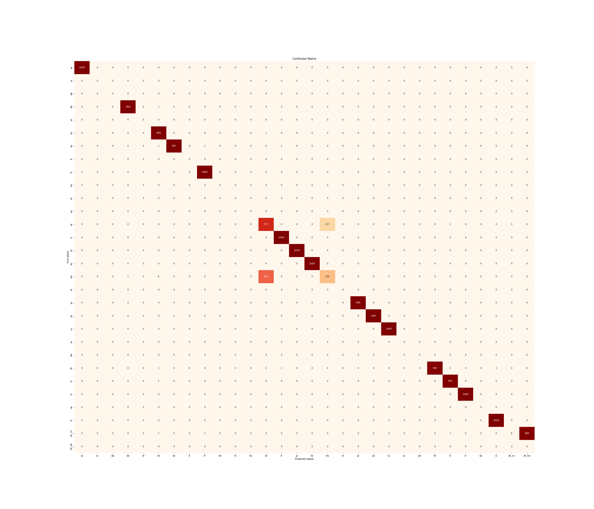

# language_detection
### 2023.01.09
* `googletrans` 모듈을 활용해서 1000개의 문장 샘플에 대해 language detect -> (lang, confidence)
* 107개의 언어로 분류

--- 
### 2023.01.10
* sample data 상태
    1) 대부분 영어가 많음 -> 데이터 분포 왜곡
    2) 다언어로 써있는 문장들 (e.g, 2255, 11873)
    3) url형 (e.g., 425, 4611, 8344)
    4) 코드형 (e.g., 4683)
    5) 번역되지 않는 언어 (e.g., 12004 -> google에서는 아이티-크리올어로 인식되지만 번역되지 않음)
    6) 이모지(e.g., 2528, 4029, 6006, 6626, 8194)
    7) 띄어쓰기가 애매함 (e.g., 5683)
    8) Unicode - Latin letter (e.g., 6577) -> 감지 에러, 번역되지 않음

* googletrans 결과
    > https://github.com/ssut/py-googletrans
    * 103분 소요 (1.95 it/s)
* LSTM-LID 결과
    > https://machinelearning.apple.com/research/language-identification-from-very-short-strings
    > https://arxiv.org/pdf/2102.06282v1.pdf
    > https://github.com/AU-DIS/LSTM_langid
    * 2분 30초 소요 (79.78 it/s)

* 모델 학습용 데이터셋
    > https://huggingface.co/datasets/papluca/language-identification
    * Data Fields
        * labels: a string indicating the language label.
        * text: a string consisting of one or more sentences in one of the 20 languages listed above.
   * Data Splits
        The Language Identification dataset has 3 splits: train, valid, and test. The train set contains 70k samples, while the validation and test sets 10k each. All splits are perfectly balanced: the train set contains 3500 samples per language, while the validation and test sets 500.

* multinomial Naïve Bayes


---
### 2021.01.11

* 베이스 모델 생성
    * 모델 학습 pipeline 구축 (`scikit-learn`-based)
        
         `loading dataset -> preprocessing -> vectorizing -> fitting -> saving model & results (accuracy)`
        
* 다른 모델 테스트 (on `papluca dataset`)
    * (기본)

        `mnnb`: Multinomial Naïve Bayes
            
            * train acc. : 0.994
            * valid acc. : 0.928
            * test acc. : 0.923

        `dt`: Decision Tree

            * train acc. : 0.999
            * valid acc. : 0.844
            * test acc. : 0.840

    * (hyperparameter tuning)

    
* 데이터 셋 확장
    * 현재 데이터 셋 기준으로?
        - 언어
        
            기존(20종)
            
            `['pt', 'bg', 'zh', 'th', 'ru', 'pl', 'ur', 'sw', 'tr', 'es', 'ar',
       'it', 'hi', 'de', 'el', 'nl', 'fr', 'vi', 'en', 'ja']`

            추가(?종)

            `['kr']`

---
### 2023.01.12

* 새로운 데이터 셋
    * OpenSubtitles(https://opus.nlpl.eu/OpenSubtitles.php)
    
    - 데이터셋 포함 언어(62종)
        
        `['af', 'ar', 'bg', 'bn', 'br', 'bs', 'ca', 'cs', 'da', 'de', 'el', 'en', 'eo', 'es', 'et', 'eu', 'fa', 'fi', 'fr', 'gl', 'he', 'hi', 'hr', 'hu', 'hy', 'id', 'is', 'it', 'ja', 'ka', 'kk', 'ko', 'lt', 'lv', 'mk', 'ml', 'ms', 'nl', 'no', 'pl', 'pt', 'pt_br', 'ro', 'ru', 'si', 'sk', 'sl', 'sq', 'sr', 'sv', 'ta', 'te', 'th', 'tl', 'tr', 'uk', 'ur', 'vi', ('ze_en', 'ze_zh'), 'zh_cn', 'zh_tw']`
        
        기존 Flitto 지원(20종)
        
        `['ar', 'zh_cn', 'zh_tw', 'cs', 'nl', 'en', 'fi', 'fr', 'de', 'hi', 'id', 'it', 'ja', 'ko', 'ms', 'pl', 'pt', 'ru', 'es', ('sw'), 'sv', 'tl', 'th', 'tr', 'vi']`

    - 목표 학습 언어(60종)
    
        `['af', 'ar', 'bg', 'bn', 'br', 'bs', 'ca', 'cs', 'da', 'de', 'el', 'en', 'eo', 'es', 'et', 'eu', 'fa', 'fi', 'fr', 'gl', 'he', 'hi', 'hr', 'hu', 'hy', 'id', 'is', 'it', 'ja', 'ka', 'kk', 'ko', 'lt', 'lv', 'mk', 'ml', 'ms', 'nl', 'no', 'pl', 'pt', 'pt_br', 'ro', 'ru', 'si', 'sk', 'sl', 'sq', 'sr', 'sv', 'ta', 'te', 'th', 'tl', 'tr', 'uk', 'ur', 'vi', 'zh_cn', 'zh_tw']`

        -> 학습용 데이터 정리 중...(`data/open_subtitles/*.parquet` -> 업로드 x)
            
        데이터 샘플 `data/os_data_sample.tsv`
---
### 2023.01.13
*  OpenSubtitles
    ```python
        # lang_os: languages in fetchted open_subtitle dataset (60), n_data_each >= 3390
        lang_os = ['hu', 'sl', 'af', 'ko', 'hi', 'sq', 'ca', 'gl', 'it', 'ml', 'ar', 'et', 'da', 'ro', 'fr', 'tl', 'pt', 'eu', 'te', 'sr', 'ms', 'lv', 'ja', 'ka', 'bg', 'de', 'br', 'nl', 'el', 'hr', 'sk', 'pt_br', 'bn', 'mk', 'is', 'th', 'pl', 'sv', 'ta', 'bs', 'cs', 'kk', 'id', 'eo', 'fi', 'no', 'es', 'lt', 'hy', 'ru', 'fa', 'he', 'si', 'en', 'ur', 'uk', 'tr', 'vi', 'zh_cn', 'zh_tw']

        # lang_os_51: n_data_each >= 93016
        lang_os_51 = ['en', 'es', 'pt_br', 'ro', 'tr', 'hu', 'sr', 'cs', 'pl', 'fr', 'el', 'bg', 'nl', 'it', 'hr', 'pt', 'he', 'ar', 'fi', 'ru', 'de', 'sl', 'sv', 'da', 'bs', 'et', 'zh_cn', 'id', 'sk', 'no', 'fa', 'zh_tw', 'vi', 'mk', 'th', 'ja', 'ms', 'sq', 'is', 'lt', 'ko', 'uk', 'eu', 'si', 'lv', 'ca', 'bn', 'ml', 'gl', 'ka', 'hi']

        # lang_flitto: service language in flitto (20)
        lang_flitto = ['ar', 'zh_cn', 'zh_tw', 'cs', 'nl', 'en', 'fi', 'fr', 'de', 'hi', 'id', 'it', 'ja', 'ko', 'ms', 'pl', 'pt', 'ru', 'es', 'sw', 'sv', 'tl', 'th', 'tr', 'vi']


        # 기존 flitto 서비스 기준에서 제외 되는 언어
        print(set(lang_flitto) - set(lang_os))
        >>> {'sw'}

        print(set(lang_flitto) - set(lang_os_51))
        >>> {'sw', 'tl'}
    ```

    --> 언어 당 90000개씩 포함하는 데이터 생성 (`data/os_data_51.tsv`)

* `mnnb`모델 학습 결과
    * accuracy

        ```python
        
            {
            "train": {
                "acc": 0.8830803921568627
            },
            "validation": {
                "acc": 0.8203254901960785
            },
            "test": {
                "acc": 0.8207098039215687
            }
            }
        
        ```

    * confusion matrix
    
        


    - 포르투갈어(pt)와 브라질리언 포르투갈어(pt_br)를 헷갈리는 경우 -> 포르투갈어만 학습
    - 우크라이나어(uk)를 러시아어로 헷갈리는 경우 -> 학습데이터 오류 가능성, 새 데이터셋으로 학습(https://wortschatz.uni-leipzig.de/en/download/Ukrainian)

---
### 2023.01.16

* `lang_data_50`

    기존 `os_data_51`에서 `uk`를 교체하고, `pt_br`을 제외함

    -> 학습 결과 `uk`의 정확도가 상승, 그러나 전반적인 데이터셋의 무결성에 대한 의심으로 다른 데이터들도 모두 교체

* `wortschartz_30`
    
    `https://wortschatz.uni-leipzig.de/en/download` 사이트 내 corpus 중 30개 언어 뉴스(없을 시 wiki 혹은 web) 데이터를 각 10K씩 다운로드.
   
     ```python
     # 데이터 출처
     {
        "ar": "news_2020",
        "zh_cn": "newscrawl_2011",
        "zh_tw": "web_2014",
        "cs": "news_2020",
        "nl": "news_2020",
        "en": "news_2020",
        "fi": "news_2020",
        "fr": "news_2020",
        "de": "news_2021",
        "hi": "news_2020",
        "id": "news_2020",
        "it": "news_2020",
        "ja": "news_2020",
        "ko": "news_2020",
        "ms": "news_2019",
        "pl": "news_2020",
        "pt": "news_2020",
        "ru": "news_2021",
        "es": "news_2020",
        "sw": "wiki_2021",
        "sv": "news_2020",
        "tl": "newscrawl_2011",
        "th": "newscrawl_2011",
        "tr": "news_2020",
        "vi": "news_2020",
        "uk": "news_2020",
        "hu": "news_2020",
        "da": "news_2020",
        "he": "news_2020",
        "el": "news_2020"
        }`

---
### 2023.01.17

* `wortschartz_30` 데이터셋에 대한 학습

    `model/*_wortschartz_30_v*/` 폴더에 기록

    현재까지 best model:

    `mnnb_wortschartz_30_v8`
    
    [config file](model/mnnb_wortschartz_30_v8/result/config.json)
    
    ```python
    "acc": {
      "train": 0.9939166666666667,
      "validation": 0.9932466666666667,
      "test": 0.99316
    }
    ```

    * confusion_matrix
     
        
    

    * insight
    1) 전체 언어(30종)에 대해 `91% 이상`의 분류 정확도
    2) 말레이어(`ms`) <-> 인도네시아어(`id`) 간의 상호 오분류 발생

* 과제 샘플 데이터에 적용 테스트 (`data/test_data/lang_detect_test.xlsx`)
    * test 언어(18종):
    `['vi', 'pt', 'th', 'de', 'zhcn'(->'zh_cn'), 'pl', 'ms', 'fr', 'it', 'ar',
       'tl', 'id', 'tr', 'ru', 'ko', 'es', 'en', 'ja']`

    * 사용 모델: `mnnb_wortschartz_30_v8`

    * confusion_matrix

        
    

    1) `89.52%`의 분류 정확도
    2) 말레이어(`ms`) <-> 인도네시아어(`id`) 간의 높은 오분류 발생 -> 모델 특성

